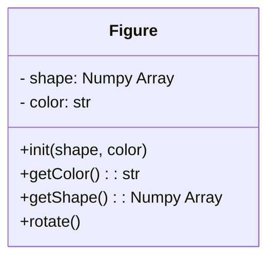

```mermaid
classDiagram
    class Figure {
        - shape: Numpy Array
        - color: str
        +init(shape, color)
        +getColor(): str
        +getShape(): Numpy Array
        +rotate()
    }
```